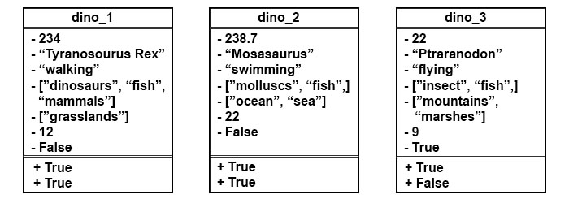
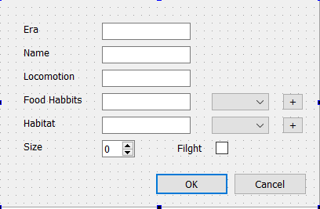
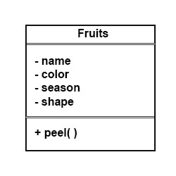
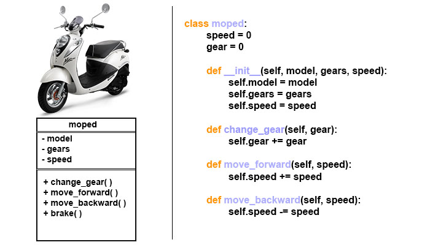

# Classes

One of the important reason why we are using Python today is because it is an Object Oriented Programming Language. And you might hear from time to time that everything in Python is an object. Lets see how i can make this mumbo jumbo a little bit more clear.

There is a transperant plastic object with a cap and a refil inside it is on my desk at the moment. Yes please note that I have mentioned an onject here. Most probably the object is identified by a name and in english we call it a pen.
Our world is scatterd with objects around if we are to feed data about objects to our computers and make them do repetative tasks, complex calculations, life saving decisions we need the computers to understand the kind of object they are dealing with by providing them a basic definition. Simply put it like if you built a robot to chop wood, how would the robot ubnderstand what is wood further robot might not know what size to cut different types of wood. The example being really stupid.

We all heard about dinosaurs. According to wikipedia Dinosaurs are a diverse group of reptiles of the clade Dinosauria. They first appeared during the Triassic period, between 243 and 233.23 million years ago, although the exact origin and timing of the evolution of dinosaurs is the subject of active research. They became the dominant terrestrial vertebrates after the Triassic–Jurassic extinction event 201.3 million years ago; their dominance continued through the Jurassic and Cretaceous periods… Basicall they are scary big lizards, lived millions of years ago that are, thank God dead now because of a big meteor. For referen please see Ice age movie series. All of these dinosaurs have a name, some legs, eating habbits, living haitats, physical size, fight capablity or incapablity. I want to make a database of  dinosaurs that are common in my area. So when I find a raptor go and tell computer here is a picture of a dinosaur please put it in your database. Well we all might know although it not impossible this is not exactly how our computers take instructions unless we programatically tell them to do so.

To do that, lets define the term Dinosaur to the computer. A dinosaur should have these properties

1.  Some animal lived long ago
2.  Has a name(type or species)
3.  Bi-pedal, fins, wings, multi-pedal
4.  Food habbits
5.  Habitat
6.  Size
7.  Flight Capablity or incapablity

And the dinosaur definition should do these tasks.

1.  Identity and return information about a Dinosaur
2.  Check if the animal can be categorized as a Dinosaur in the first place.

A basic representation of dinosaur could be,

<!-- This HTML table template is generated by emacs 26.1 -->
<table border="1">
  <tr>
    <td align="left" valign="top">
      &nbsp;&nbsp;&nbsp;&nbsp;&nbsp;&nbsp;Dinosaur&nbsp;&nbsp;&nbsp;&nbsp;&nbsp;&nbsp;
    </td>
  </tr>
  <tr>
    <td align="left" valign="top">
      -era(year)&nbsp;-&nbsp;Float&nbsp;&nbsp; 
      -name&nbsp;-&nbsp;String&nbsp;&nbsp;&nbsp;&nbsp;&nbsp;&nbsp; 
      -locomotion&nbsp;-&nbsp;String 
      -food_habbits&nbsp;-&nbsp;List 
      -habitat&nbsp;-&nbsp;List&nbsp;&nbsp;&nbsp;&nbsp;&nbsp; 
      -size&nbsp;-&nbsp;Integer&nbsp;&nbsp;&nbsp;&nbsp;&nbsp; 
      -flight-Boolean&nbsp;&nbsp;&nbsp;&nbsp;&nbsp; 
      &nbsp;&nbsp;&nbsp;&nbsp;&nbsp;&nbsp;&nbsp;&nbsp;&nbsp;&nbsp;&nbsp;&nbsp;&nbsp;&nbsp;&nbsp;&nbsp;&nbsp;&nbsp;&nbsp;&nbsp;
    </td>
  </tr>
  <tr>
    <td align="left" valign="top">
      +identifyDinosaur&nbsp;&nbsp;&nbsp; 
      +checkIfDinosaur&nbsp;&nbsp;&nbsp;&nbsp;
    </td>
  </tr>
</table>

In Python this representation can be written as,

    
    class Dinosaurs:
    ''' The dinosaur is a pre historic animal '''
        era = 1                      # Default value 1
        name = ""                    # Empty String
        locomotion = ""              # Empty String
        food_habbits = []            # Empty List
        habitat = []                 # Empty List
        size = 0                     # Default Value 0
        flight = False               # Default False
    
        def identifyDinosaur(self, dino_name):
            return dino_name in self.name
    
        def checkIfDinosaur(self):
            if self.era<243 and self.era>233.23:
                return True

This is actually how a Class in python is defined. But wait lets use it.

    dino_1 = Dinosaurs()

Or

    dino_2 = Dinosaurs()

So whats this business with "self". Well to understand self we need to look into the statement
dino3 = Dinosaurs()
This is a way of utilising the class Dinosaurs to define dino3 as a dinosaur to the computer. So if we type,

    print(dino_1.name)                     #Result: ""
    print(dino_1.era)                      #Result: 1
    print(dino_2.food_habbits)             #Result: []
    print(dino_3.locomotion)               #Result: ""
    # We can even use methods
    print(dino_1.identifyDinosaur("Tyranosorus Rex"))            #Result: False
    print(dino_2.checkIfDinosaur())                              #Result: False

dino1, dino2 and dino3 are instances of the class Dinosaurs().
so dino1 will have its own/unique set of era, name, locomotion, food habbits, etc. So will dino2. And so will dino3. If we had dino4, dino5 or harrypotter or deshbhaktaviik these would all have the unique attribute values of
era, name, locomotion, etc. "Self" parameter here represents the instance itself. The naming convention suggests that we call the instance self rather than tom, harry, or someinstance although that can be done. Some more naming conventions. Class names should start with a capital letter or Camel cased. Avoid underscores for class names. Generally class names are plurals. Good class names are Students(), ObsoleteAccounts(), ProgramErrors(). Variables inside classes are called attributes and functions are called methods. So now these instances of Dinosaurs() can be represented as,

Now look those values that has replaced the   tributes. Looks like a big mess. So much so for Object Oriented Programming. This looks like a mockery and a waste of precious time. But its not what it looks like here the attribute values can be over-written for each individual instances.

    dino_1.era = 234
    dino_1.name = "Tyranosorus rex"
    dino_1.locomotion = "walking"
    dino_1.food_habbits = ["dinosaurs", "insects", "fishes"]
    dino_1.habitat = ["grasslands"]
    dino_1.size = 12
    dino_1.flight = False
    # We can even use methods
    print(dino_1.identifyDinosaur("Tyranosorus rex"))            #Result: True
    print(dino_1.checkIfDinosaur())                              #Result: True

Similiarly we can do the same treatment to the instances dino2 and dino3.

    dino_2.era = 238.7
    dino_2.name = "Mosasaurus"
    dino_2.locomotion = "swimming"
    dino_2.food_habbits = ["molluscs", "fishes"]
    dino_2.habitat = ["seas", "oceans"]
    dino_2.size = 17
    dino_2.flight = False
    dino_3.era = 22
    dino_3.name = "Pteranodon"
    dino_3.locomotion = "flying"
    dino_3.food_habbits = ["insects", "fishes"]
    dino_3.habitat = ["mountains", "marshes"]
    dino_3.size = 9
    dino_3.flight = True
    # We can even use methods
    print(dino_2.identifyDinosaur("Mosasaurus"))            #Result: True
    print(dino_2.checkIfDinosaur())                         #Result: True
    print(dino_3.identifyDinosaur("Pteranodon"))            #Result: True
    print(dino_3.checkIfDinosaur())                         #Result: False

Hence the representation of these tables have changed,

The whole process may be given a GUI.

Well while creating an instance what if we could place the values of era, name, locomotion, habitat, foodhabbits,size and flight as a parameter it would spare us the extra time in gathering information one by one. One way of doing that is by initializing the instance as,

    dino_1 = Dinosaurs(234, "Tyranosorus rex", "walking", ["dinosaurs", "insects", "fishes"], ["grasslands"], 12, False)

This way whenever we press ok in the GUI shown in figure1 we end up creating an instace with the initiated values. Constructors are special class members which are called by the Python interpreter every time an object of that class is instantiated. A constructor of a class is actually a member function of the class its declared as:

    class Cowboys:
        def __init__():
    ''' This is the constructor '''
            pass

Some more examples are:

 

Similiarly like a constructor there is a destrutor. Its use unlike the constructor is to destroy/delete an instance of the class. Its declared as:

    class Cowboys:
        def __init__(self):
        # Used to construct the instance
            pass
    
        def __del__(self):
        # Used to destroy an instance
            pass

These double underscore also known as dunder methods are also called magic methods. Lets recreate Dinosaurs class using the constructor method.

    class Dinosaurs():
        def __init__(self, era, name, locomotion, habitat, food_habbits, size, flight):
    ''' This is the constructor '''
            self.era = era
            self.name = name
            self.locomotion = locomotion
            self.habitat = habitat
            self.food_habbits = food_habbits
            self.size = size
            self.flight = flight
    
        def __del__(self):
            return f'Instance Destroyed with name {self.name}'

So now,

    dino_1 = Dinosaurs(234, "Tyranosorus rex", "walking", ["dinosaurs", "insects", "fishes"], ["grasslands"], 12, False)
    dino_2 = Dinosaurs(238.7, "Mosasasaurus", "swimming", ["molluscs", "fish"], ["ocean", "sea"], 22, False)
    dino_3 = Dinosaurs(234, "Ptarandon", "flying", ["insect", "fish"], ["mountains", "marshes"], 9, True)
    
    del dino_2    # Deletes/destroys dino_2 instance

Some examples

lets see some practical use of class in creating a notebook app. Where the user stores notes taken under different titles and also has an additional feature of applying tags to the notes. Notebooks have notes and notes have text, title, tags, date. A few methods we can assign to the Notebook are, search note(by tag, title), add new note, modify a note, show all notes.

This is an example of one to many relationship where a notebook can have multiple notes.

We can model our Note class as,

     1  # !/usr/bin/env python3
     2  
     3  from datetime import datetime
     4  
     5  
     6  class Note:
     7      def __init__(self, memo="", title="", tags=[]):
     8          self.memo = memo
     9          self.title = title
    10          self.tags = tags
    11          self.time_now = datetime.now()
    12  
    13      def match(self, filter):
    14          return filter in self.title or filter in self.tags
    15  
    16      def __del__(self):
    17          return f'Note titled {self.title} created on {self.time_now} deleted!'
    18  
    19      def __repr__(self):
    20          return f'{self.title} created at {self.time_now}'

The Note class can be utilised by making instances like, 

    1  # mynote = Note("dcgvbihlbyttv tdxcty tgiuib", "jibrish", ["nothing", "everything"])

Now Notebook is initialised as with an empty list. And when we use the Notebook.addNote(parameters here) feature we are creating a new Note with the parameters as values for content, title, tags and date. Lets see the new updated code.

     1  # !/usr/bin/env python3
     2  
     3  from datetime import datetime
     4  
     5  
     6  class Note:
     7      def __init__(self, memo="", title="", tags=[]):
     8          self.memo = memo
     9          self.title = title
    10          self.tags = tags
    11          self.time_now = datetime.now()
    12  
    13      def match(self, filter):
    14          return filter in self.title or filter in self.tags
    15  
    16      def __del__(self):
    17          return f'Note titled {self.title} created on {self.time_now} deleted!'
    18  
    19      def __repr__(self):
    20          return f'{self.title} created at {self.time_now}'
    21  
    22  
    23  class Notebook:
    24      def __init__(self):
    25          self.my_notes = []
    26  
    27      def addNote(self, memo_body, title_body, tags):
    28          my_note = Note(memo=memo_body, title=title_body, tags=tags)
    29          self.my_notes.append(my_note)
    30  
    31      def searchNote(self, filter):
    32          for note in self.my_notes:
    33              if note.match(filter):
    34                  return note

We can utilize this new class Notebook to collect as many notes as we want as long as we can provide the information for the parameters in the proper data format and in the proper order. Lets see how the utilization of this code can be done,

    1  # my_notebook = Notebook()
    2  # my_notebook.addNote("time to get grocery", "grocery", ["shopping", "grocery"])
    3  # my_notebook.addNote("python class examples for sem4", "programming", ["python", "sem4"])
    4  # my_notebook.addNote("learn shading in blender", "Shading in blender", ["blender", "shading"])

We are definitely getting somewhere. But I bet typing those long addNote() functions are not so interesting. So lets add an interface to these two objects. This interface will prompt user for inputs, it will also show all the stored notes that we have. Also we will have options to search for notes and quit our beautiful application. Ofcourse we can add a few features to our interface like deleting a note, modifying the body of a note and modifying the title of a note trust me we will update our app to version 2.0 which will contain the features.

     1  # !/usr/bin/env python3
     2  
     3  from datetime import datetime
     4  
     5  
     6  class Note:
     7      def __init__(self, memo="", title="", tags=[]):
     8          self.memo = memo
     9          self.title = title
    10          self.tags = tags
    11          self.time_now = datetime.now()
    12  
    13      def match(self, filter):
    14          return filter in self.title or filter in self.tags
    15  
    16      def __del__(self):
    17          return f'Note titled {self.title} created on {self.time_now} deleted!'
    18  
    19      def __repr__(self):
    20          return f'{self.title} created at {self.time_now}'
    21  
    22  
    23  class Notebook:
    24      def __init__(self):
    25          self.my_notes = []
    26  
    27      def addNote(self, memo_body, title_body, tags):
    28          my_note = Note(memo=memo_body, title=title_body, tags=tags)
    29          self.my_notes.append(my_note)
    30  
    31      def searchNote(self, filter):
    32          for note in self.my_notes:
    33              if note.match(filter):
    34                  return note
    35  
    36  
    37  class NotebookInterface:
    38      def __init__(self):
    39          self.my_notebook = Notebook()
    40          self.menu()
    41  
    42      def menu(self):
    43          print('''
    44          1. Add Note
    45          2. Search Note
    46          3. List all notes
    47          4. Quit Program
    48          ''')
    49          self.run()
    50  
    51      def run(self):
    52          while True:
    53              choice = input("Enter Choice: ")
    54              if choice == "1":
    55                  memo = input("Enter the content: ")
    56                  title = input("Enter a Title: ")
    57                  tags = input("Enter tags seperated by commas: ").strip().split(",")
    58                  self.my_notebook.addNote(memo, title, tags)
    59                  continue
    60              elif choice == "2":
    61                  current_filter = input("Enter an indentifiable tag or title: ")
    62                  self.my_notebook.searchNote(current_filter)
    63                  continue
    64              elif choice == "3":
    65                  for note in self.my_notebook.my_notes:
    66                      print(f'{note.title} created on {note.time_now}')
    67                  continue
    68              elif choice == "4":
    69                  break
    70              else:
    71                  print("Enter a valid choice.")

To execute the program just type,

    1  myApp = NotebookInterface()

