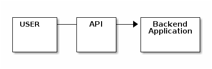

# Blender API

Before we start talking about API and Python, let us understand a few core concepts of Blender.

## Blender Directory Layout

<table border="2" cellspacing="0" cellpadding="6" rules="groups" frame="hsides">

<colgroup>
<col  class="org-left" />

<col  class="org-left" />

<col  class="org-left" />

<col  class="org-left" />
</colgroup>
<thead>
<tr>
<th scope="col" class="org-left">Location</th>
<th scope="col" class="org-left">Use</th>
<th scope="col" class="org-left">url in Windows</th>
<th scope="col" class="org-left">url in MacOS</th>
</tr>
</thead>

<tbody>
<tr>
<td class="org-left">LOCAL</td>
<td class="org-left">Location of configuration and runtime data.</td>
<td class="org-left">.\\2.83\\</td>
<td class="org-left">./2.83/</td>
</tr>

<tr>
<td class="org-left">USER</td>
<td class="org-left">Location of configuration files</td>
<td class="org-left">%USERPROFILE%\AppData\Roaming\Blender Foundation\Blender\\2.83\\</td>
<td class="org-left">*Users/$USER/Library/Application Support/Blender/2.83*</td>
</tr>

<tr>
<td class="org-left">SYSTEM</td>
<td class="org-left">Location of run-time data for system wide installation</td>
<td class="org-left">%USERPROFILE%\AppData\Roaming\Blender Foundation\Blender\\2.83\\</td>
<td class="org-left">*Library/Application Support/Blender/2.83*</td>
</tr>
</tbody>
</table>

The path ./2.83/ is relative to the Blender executable.

Windows Users
For default installation location addons is usually found in;

    C:\Program Files\Blender Foundation\blender\[version]\addons 

For the secondary "User" location, addons is usually found in;

    C:\Users\[profile]\AppData\Roaming\Blender Foundation\...

homefile: '*home/aviik*.config/blender/2.82/config/startup.blend

## Scenes

Scenes are a way to organize your work. Each blend-file can contain multiple scenes, which share other data such as objects and materials.
<https://i.imgur.com/GUF3vAhl.png>

## Objects

A Blender scene is constructed from one or more objects. These objects can range from lights to illuminate your scene, basic 2D and 3D shapes to fill it with models, armatures to animate those models, to cameras. Blender object type (mesh, light, curve, camera, etc.) is composed from two parts: an Object and Object Data.
1.Object-Holds information about the position, rotation and size of a particular element.
2.Holds everything else. For example:

Meshes

    Store geometry, material list, vertex groups, etc.
Cameras

    Store focal length, depth of field, sensor size, etc.
 

Objects in Blender could be of the following types:

<table border="2" cellspacing="0" cellpadding="6" rules="groups" frame="hsides">

<colgroup>
<col  class="org-left" />

<col  class="org-left" />
</colgroup>
<thead>
<tr>
<th scope="col" class="org-left">Object</th>
<th scope="col" class="org-left">Description</th>
</tr>
</thead>

<tbody>
<tr>
<td class="org-left">Mesh</td>
<td class="org-left">Meshes are objects composed of Polygonal Faces, Edges and/or Vertices, and can be edited extensively with Blender’s mesh editing tools.</td>
</tr>

<tr>
<td class="org-left">Curve</td>
<td class="org-left">Curves are mathematically defined objects which can be manipulated with control handles or control points (instead of vertices), to manage their length and curvature.</td>
</tr>

<tr>
<td class="org-left">Surface</td>
<td class="org-left">Surfaces are patches of geometry.</td>
</tr>

<tr>
<td class="org-left">Metaball</td>
<td class="org-left">Metaballs have volume. They also have an attribute to attract other metaballs in joining togather forming a larger topology.</td>
</tr>

<tr>
<td class="org-left">Text</td>
<td class="org-left">Text Objects create a two-dimensional representation of a string of characters.</td>
</tr>

<tr>
<td class="org-left">Grease Pencil</td>
<td class="org-left">Grease Pencil Objects are objects created by painting strokes.</td>
</tr>

<tr>
<td class="org-left">Armature</td>
<td class="org-left">Armatures are used for rigging 3D models in order to make them poseable and animateable.</td>
</tr>

<tr>
<td class="org-left">Lattice</td>
<td class="org-left">Lattices are non-renderable wireframes, commonly used for taking additional control over other objects with help of the Lattice Modifier.</td>
</tr>

<tr>
<td class="org-left">Empty</td>
<td class="org-left">Empties are null objects that are simple visual transform nodes that do not render. They are useful for controlling the position or movement of other objects.</td>
</tr>

<tr>
<td class="org-left">Image</td>
<td class="org-left">Images are empty objects that display images in the 3D Viewport. These images can be used to support modeling and animating.</td>
</tr>

<tr>
<td class="org-left">Light</td>
<td class="org-left">Lights for lighting the scene in renders.</td>
</tr>

<tr>
<td class="org-left">Light Probe</td>
<td class="org-left">Lights are used by the Eevee render engine and record lighting information for indirect lighting.</td>
</tr>

<tr>
<td class="org-left">Camera</td>
<td class="org-left">This is the virtual camera that is used to determine what appears in the render. See Cameras in Cycles.</td>
</tr>

<tr>
<td class="org-left">Speaker</td>
<td class="org-left">Speaker brings a source of sound to the scene.</td>
</tr>

<tr>
<td class="org-left">Force Field</td>
<td class="org-left">Force Fields are used in physical simulations. They give simulations external forces.</td>
</tr>

<tr>
<td class="org-left">Collection Instance</td>
<td class="org-left">Instances of existing collections.</td>
</tr>
</tbody>
</table>

## Collections

There can be many objects in a scene: A typical stage scene consists of furniture, props, lights, and backdrops. Blender helps you keep everything organized by allowing you to group like objects together. Objects can be grouped together without any kind of transformation relationship (unlike parenting). Collections are used to just logically organize your scene, or to facilitate one-step appending or linking between files or across scenes. Also View Layers refernce to collections and allow to set their visibility, selectability and other options. A view layer can have any collection enabled, and multiple view layers can use the same or different collections.

## API

An application programming interface (API) is a computing interface which defines interactions between multiple software intermediaries.

In other words blender possibly uses C/C++ programming heavily as observed from the gitgub repository of their source code. The Python based API offers an interface with the core engine of blender.

## Extending Blender with Python

### Scripts

A Python script in Blender is a collection of commands in a file designed to be executed like a program directly or importing it as a module.
Some ways to run scripts directly in Blender,

-   Loaded in the text editor and press Run Script.
-   Typed or pasted into the interactive console.
-   Typed in the the command line with Blender keyword. 
    -   Example:
        
            blender --python /home/me/my_script.py

Many Python scripts come bundled with Blender and can be used as a reference because they use the same API that script authors write tools in. Typical usage for scripts include: user interface, import/export, scene manipulation, automation, defining your own toolset and customization.
On startup Blender scans the scripts/startup/ directory for Python modules and imports them. The exact location of this directory depends on your installation.

### Addons

Some of Blender functionality is kept optional, alongside scripts loaded at startup we have addons which are kept in their own directory scripts/addons, and only load on startup if selected from the user preferences. An addon is simply a Python module with some additional requirements so Blender can display it in a list with useful information. Addons must contain a **bl\_info** variable which Blender uses to read metadata such as name, author, category and URL.

## Python Programming Environment in Blender

The two most common ways to execute Python scripts are using the built-in text editor or entering commands in the Python console. Please use the console window to recieve output. Swithching on python tool tips in the prefernces of Blender helps a lot in knowing the functions associated with menus and buttons.

# The BPY Module

Blender sets up its python environment when it is started and stays active till blender process is killed. Blender provides the bpy module to the Python interpreter. This module can be imported in a script and gives access to Blender data, classes, and functions.

    # To use bpy module 
    import bpy

Unfortunately the ‘bpy’ module cannot be used outside of Blender. But there are some workarounds to use Python efficiently inside Blender or we can use bpy library inside other IDEs.

-   Check-out pip install fake-bpy-module-<version> where version could be the blender version you are using. More info at <https://github.com/nutti/fake-bpy-module>
-   Add Blender Intellisense for scripting within blender environment.

## 01. The Basic Modules

### bpy.ops [Link](https://docs.blender.org/api/current/bpy.ops.mesh.html)

1.  Circle

        import bpy                                               #imports the bpy library in BLENDER
        
        bpy.ops.mesh.primitive_circle_add(radius=1,
                                          vertices = 20,
                                          location=(0,4,0))
    
    1.  parameters
    
        -   vertices
        -   radius
        -   location=(0.0, 0.0, 0.0)
        -   rotation=(0.0, 0.0, 0.0)

2.  Sphere (Ico-sphere)

        import bpy                                                #imports the bpy library in BLENDER
        bpy.ops.mesh.primitive_ico_sphere_add(subdivisions = 3,
                                              radius=4,
                                              location=(2,7,8),
                                              rotation=(0,0,0))
    
    1.  parameters
    
        -   subdivisions
        -   radius
        -   location=(0.0, 0.0, 0.0)
        -   rotation=(0.0, 0.0, 0.0)

3.  Cube

        import bpy                                                #imports the bpy library in BLENDER
        bpy.ops.mesh.primitive_cube_add(size = 3,
                                        location=(2,7,8),
                                        rotation=(0,0,0))
    
    1.  parameters
    
        -   size
        -   align
        -   location=(0.0, 0.0, 0.0)
        -   rotation=(0.0, 0.0, 0.0)

4.  Selection

    1.  bpy.ops.object.select\_all()
    
        -   action = 'SELECT'
        -   action = 'DESELECT'
    
    2.  bpy.ops.object.mode\_set(mode='EDIT')
    
        -   mode='EDIT'
        -   mode='OBJECT'
    
    3.  bps.ops.mesh.select\_mode(type='FACE')
    
    4.  bps.ops.mesh.select\_mode(type='VERT')

### bpy.context [Link](https://docs.blender.org/api/current/bpy.ops.mesh.html)

1.bpy.context.scene.objects
Returns a collection of scene objects.

    print([i for i in bpy.context.scene.objects])
    # or the statement can also be written as, 
    print(list(bpy.context.scene.objects))
    
    # Please note that printint type of bpy.context.scene.objects yeild "bpy_prop_collection"
    print(type(bpy.context.scene.objects))
    # Results in: <class 'bpy_prop_collection'>

2.bpy.context.selected\_objects

    # After selecting an object on the 3D View 
    print([i for i in bpy.context.selected_objects])
    # With some exception handling incase nothing is selected.
    if bpy.context.selected_objects != []:
        print(list(bpy.context.selected_objects))

3.bpy.context.active\_object

### bpy.type [Link](https://docs.blender.org/api/current/bpy.ops.mesh.html)

1.  Operator

        import bpy
        
        
        class HelloWorldOperator(bpy.types.Operator):
            bl_idname = "wm.hello_world"
            bl_label = "Minimal Operator"
        
            def execute(self, context):
                print("Hello World")
                return {'FINISHED'}
        
        
        bpy.utils.register_class(HelloWorldOperator)
        
        # test call to the newly defined operator
        bpy.ops.wm.hello_world() 

2.  Panel

        import bpy
        
        
        class HelloWorldPanel(bpy.types.Panel):
            """Creates a Panel in the Object properties window"""
            bl_label = "Hello World Panel"
            bl_idname = "OBJECT_PT_hello"
            bl_space_type = 'PROPERTIES'
            bl_region_type = 'WINDOW'
            bl_context = "object"
        
            def draw(self, context):
                layout = self.layout
        
                obj = context.object
        
                row = layout.row()
                row.label(text="Hello world!", icon='WORLD_DATA')
        
                row = layout.row()
                row.label(text="Active object is: " + obj.name)
                row = layout.row()
                row.prop(obj, "name")
        
                row = layout.row()
                row.operator("mesh.primitive_cube_add")
        
        
        def register():
            bpy.utils.register_class(HelloWorldPanel)
        
        
        def unregister():
            bpy.utils.unregister_class(HelloWorldPanel)
        
        
        if __name__ == "__main__":
            register()

### bpy.data [Link](https://docs.blender.org/api/current/bpy.ops.mesh.html)

1.  Exploring the Blend Scene 
    
        1  print(list(bpy.data.objects))          
        2  # Results: [bpy.data.objects['Camera'], bpy.data.objects['Cube'], bpy.data.objects['Light']]

-Please note bpy.data.objects['Object\_Name'] can be used to check Attributes.   

2.my\_object.data.vertices

3.my\_object.data.faces

4.Another Method to select objects(By Name)

## 02. BLENDER object, active\_object and selected\_objects

Anything and everything in a blender scene is a Blender Object.

## 03. Selecting Objects (meshes) in BLENDER.

Selection determines which elements will be the target of our actions. Blender has different selection methods for Object Mode and in Edit Mode. In blender all objects are outlined in orange. The object which is outlined in yellow is the last selected object or the active object. An active object tends to remain an active object till another object is selected.

### Object Mode

Blender distinguishes between two different states of selection

1.  The last (de)selected item is called the “Active Object” and is outlined in yellow (the others are orange). There is at most one active object at any time. Many actions in Blender use the active object as a reference.

### Using a getter to check whether an object is selected

-   bpy.context.active\_object.select\_get()

## 04. Accessing Attributes

## 05. Example Programs

1.  Creating a grid of boxes

    A simple python program to iterate over a list in list scenario where for every iteration of x, a y range is also iterated.
    
        1  import bpy 
        2  import random
        3  
        4  
        5  for x in range(0, 3):             # Change the maxvalue of range to increase the number of boxes and spread of the boxes in X direction.
        6      for y in range(0, 3):         # Same as above but in Y direction. Note range function range(0,n) yeilds numbers from 0 to n-1.
        7          bpy.ops.mesh.primitive_cube_add(location=(x,y,0))
    
    Lets randomize some attributes of the boxes.
    
        1  import bpy 
        2  import random
        3  
        4  
        5  for x in range(0, 20):
        6      for y in range(0, 15):
        7          r = random.uniform(0.2, 0.6)
        8          bpy.ops.mesh.primitive_cube_add(size=round(r,1), location=(x,y,0))
    
    We can even add some depth to this. By adding a yz plane. (Remember in  Blender Z axis is upwards.)
    
        1  import bpy 
        2  import random
        3  
        4  
        5  for x in range(0, 3):
        6      for y in range(0,3):
        7          for z in range (0, 3):
        8              r = random.uniform(0.2, 0.6)
        9              bpy.ops.mesh.primitive_cube_add(size=round(r,1), location=(x,y,z))

2.  Creating a set of spheres at each vertex of a circle.

        1  import bpy
        2  
        3  bpy.ops.mesh.primitive_circle_add(radius=6, vertices=12)
        4  
        5  my_circ = bpy.context.object
        6  cir_verts = len(my_circ.data.vertices)
        7  
        8  for i in range(cir_verts):
        9      bpy.ops.mesh.primitive_ico_sphere_add(subdivisions = 3, radius=1.2, location = my_circ.data.vertices[i].co)

