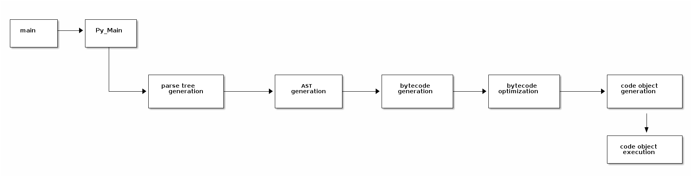

# Table of Contents

1.  [Introduction](#org1e1a67a)
        1.  [Why Use Python](#org9021a71)
        2.  [How Python is Implemented](#org06fb719)
        3.  [Software offering Python Interface](#org4d7616b)
2.  [Tools](#org6c00b40)
3.  [Introduction To Python Programming](#org36eb161)
        1.  [Running a Python program](#org69183a8)
    1.  [Python Programming](#orgb34c48b)
        1.  [Basic Python Programming](#orge51ef22)
        2.  [Intermediate Python Concepts](#orgcc1cb60)
        3.  [Advanced Python](#org0ae226b)
        4.  [Object Oriented Programming](#org2770515)
        5.  [Gui Development with PyQt](#orgddcbebd)
4.  [Blender - Python API](#orgeac3156)

# Introduction

### Why Use Python

-   A-cessible.Being an open-source language, Python is completely free to download and use. This can already contribute to project cost reductions.Besides that, it requires very little setup to run.
-   C-oss platform.Python is supported by all major operating systems: Windows, Linux distributions and Mac OS.
-   Easy to grasp.The reason behind that is a very simple syntax, which in turn reduces syntactical overhead and steepens the learning curve. It is largely recommended as a good choice for a first programming language to learn.
-   Readability.Indeed, Python has a very clear syntax enhanced by a set of punctuation rules and is easy to readand understandbecause it bears close resembles to English language.
-   OOP support.By creating, using and re-using data structures, one can minimizethe amount of coding required to accomplish a certain task.
-   Extensive libraries.Python comes with a massive standard library and extensions for any type of programming tasks.
-   Interpreted. Python is processed at runtime and there is no need to wait for the com-pilation phase to complete thus reducing development time and stimulating the learn-ing process.
-   Large community. Not only Python user community is very large, but also it offers a lot of support, shares resources and in general stimulates the learning process.
-   Transferable. Python is very portable and can work on a wide gamut of various hard-ware devices.
-   Great documentation. Python is equipped with comprehensive documentation mak-ing problem solving much easier.

### How Python is Implemented

<!-- This HTML table template is generated by emacs 26.1 -->
<table border="1">
  <tr>
    <td align="left" valign="top">
      &nbsp;&nbsp;&nbsp;&nbsp;&nbsp;&nbsp;&nbsp;&nbsp;&nbsp;&nbsp;&nbsp;&nbsp;&nbsp;&nbsp;&nbsp;&nbsp;&nbsp;&nbsp;&nbsp;&nbsp;&nbsp;&nbsp;&nbsp;&nbsp;&nbsp;&nbsp;&nbsp;&nbsp;&nbsp;&nbsp;&nbsp;&nbsp;&nbsp;&nbsp;&nbsp;&nbsp;&nbsp;&nbsp;&nbsp;&nbsp;&nbsp;&nbsp;&nbsp;&nbsp;&nbsp;&nbsp;&nbsp;&nbsp;&nbsp;&nbsp;&nbsp;&nbsp;&nbsp;&nbsp;&nbsp;&nbsp;&nbsp;&nbsp;&nbsp;&nbsp;&nbsp;&nbsp;&nbsp;&nbsp;&nbsp;&nbsp;&nbsp;&nbsp;&nbsp;&nbsp;&nbsp; 
      &nbsp;&nbsp;&nbsp;&nbsp;&nbsp;&nbsp;&nbsp;&nbsp;&nbsp;&nbsp;&nbsp;&nbsp;&nbsp;&nbsp;&nbsp;&nbsp;&nbsp;&nbsp;&nbsp;&nbsp;&nbsp;&nbsp;&nbsp;&nbsp;&nbsp;&nbsp;&nbsp;&nbsp;&nbsp;&nbsp;&nbsp;&nbsp;&nbsp;&nbsp;&nbsp;&nbsp;&nbsp;&nbsp;&nbsp;&nbsp;&nbsp;&nbsp;&nbsp;&nbsp;&nbsp;&nbsp;&nbsp;&nbsp;&nbsp;&nbsp;&nbsp;&nbsp;&nbsp;&nbsp;&nbsp;&nbsp;&nbsp;&nbsp;&nbsp;&nbsp;&nbsp;&nbsp;&nbsp;&nbsp;&nbsp;&nbsp;&nbsp;&nbsp;&nbsp;&nbsp;&nbsp; 
      t&nbsp;is&nbsp;often&nbsp;alleged&nbsp;that&nbsp;automation&nbsp;of&nbsp;repetitive&nbsp;and&nbsp;routine&nbsp;tasks&nbsp;is&nbsp;o 
      &nbsp;&nbsp;&nbsp;&nbsp;&nbsp;&nbsp;&nbsp;&nbsp;&nbsp;&nbsp;&nbsp;&nbsp;&nbsp;&nbsp;&nbsp;&nbsp;&nbsp;&nbsp;&nbsp;&nbsp;&nbsp;&nbsp;&nbsp;&nbsp;&nbsp;&nbsp;&nbsp;&nbsp;&nbsp;&nbsp;&nbsp;&nbsp;&nbsp;&nbsp;&nbsp;&nbsp;&nbsp;&nbsp;&nbsp;&nbsp;&nbsp;&nbsp;&nbsp;&nbsp;&nbsp;&nbsp;&nbsp;&nbsp;&nbsp;&nbsp;&nbsp;&nbsp;&nbsp;&nbsp;&nbsp;&nbsp;&nbsp;&nbsp;&nbsp;&nbsp;&nbsp;&nbsp;&nbsp;&nbsp;&nbsp;&nbsp;&nbsp;&nbsp;&nbsp;&nbsp;&nbsp; 
      .Software&nbsp;extension.&nbsp;&nbsp;&nbsp;&nbsp;&nbsp;&nbsp;&nbsp;&nbsp;&nbsp;&nbsp;&nbsp;&nbsp;&nbsp;&nbsp;&nbsp;&nbsp;&nbsp;&nbsp;&nbsp;&nbsp;&nbsp;&nbsp;&nbsp;&nbsp;&nbsp;&nbsp;&nbsp;&nbsp;&nbsp;&nbsp;&nbsp;&nbsp;&nbsp;&nbsp;&nbsp;&nbsp;&nbsp;&nbsp;&nbsp;&nbsp;&nbsp;&nbsp;&nbsp;&nbsp;&nbsp;&nbsp;&nbsp;&nbsp;&nbsp;&nbsp;&nbsp; 
      &nbsp;&nbsp;&nbsp;&nbsp;&nbsp;&nbsp;&nbsp;&nbsp;&nbsp;&nbsp;&nbsp;&nbsp;&nbsp;&nbsp;&nbsp;&nbsp;&nbsp;&nbsp;&nbsp;&nbsp;&nbsp;&nbsp;&nbsp;&nbsp;&nbsp;&nbsp;&nbsp;&nbsp;&nbsp;&nbsp;&nbsp;&nbsp;&nbsp;&nbsp;&nbsp;&nbsp;&nbsp;&nbsp;&nbsp;&nbsp;&nbsp;&nbsp;&nbsp;&nbsp;&nbsp;&nbsp;&nbsp;&nbsp;&nbsp;&nbsp;&nbsp;&nbsp;&nbsp;&nbsp;&nbsp;&nbsp;&nbsp;&nbsp;&nbsp;&nbsp;&nbsp;&nbsp;&nbsp;&nbsp;&nbsp;&nbsp;&nbsp;&nbsp;&nbsp;&nbsp;&nbsp; 
      &nbsp;&nbsp;&nbsp;&nbsp;&nbsp;&nbsp;&nbsp;&nbsp;&nbsp;&nbsp;&nbsp;&nbsp;&nbsp;&nbsp;&nbsp;&nbsp;&nbsp;&nbsp;&nbsp;&nbsp;&nbsp;&nbsp;&nbsp;&nbsp;&nbsp;&nbsp;&nbsp;&nbsp;&nbsp;&nbsp;&nbsp;&nbsp;&nbsp;&nbsp;&nbsp;&nbsp;&nbsp;&nbsp;&nbsp;&nbsp;&nbsp;&nbsp;&nbsp;&nbsp;&nbsp;&nbsp;&nbsp;&nbsp;&nbsp;&nbsp;&nbsp;&nbsp;&nbsp;&nbsp;&nbsp;&nbsp;&nbsp;&nbsp;&nbsp;&nbsp;&nbsp;&nbsp;&nbsp;&nbsp;&nbsp;&nbsp;&nbsp;&nbsp;&nbsp;&nbsp;&nbsp; 
      ome&nbsp;post-production&nbsp;companies&nbsp;have&nbsp;a&nbsp;dedicated&nbsp;R&D&nbsp;department&nbsp;that&nbsp;work 
      &nbsp;&nbsp;&nbsp;&nbsp;&nbsp;&nbsp;&nbsp;&nbsp;&nbsp;&nbsp;&nbsp;&nbsp;&nbsp;&nbsp;&nbsp;&nbsp;&nbsp;&nbsp;&nbsp;&nbsp;&nbsp;&nbsp;&nbsp;&nbsp;&nbsp;&nbsp;&nbsp;&nbsp;&nbsp;&nbsp;&nbsp;&nbsp;&nbsp;&nbsp;&nbsp;&nbsp;&nbsp;&nbsp;&nbsp;&nbsp;&nbsp;&nbsp;&nbsp;&nbsp;&nbsp;&nbsp;&nbsp;&nbsp;&nbsp;&nbsp;&nbsp;&nbsp;&nbsp;&nbsp;&nbsp;&nbsp;&nbsp;&nbsp;&nbsp;&nbsp;&nbsp;&nbsp;&nbsp;&nbsp;&nbsp;&nbsp;&nbsp;&nbsp;&nbsp;&nbsp;&nbsp; 
      .Pipeline/workflow&nbsp;enhancers.&nbsp;&nbsp;&nbsp;&nbsp;&nbsp;&nbsp;&nbsp;&nbsp;&nbsp;&nbsp;&nbsp;&nbsp;&nbsp;&nbsp;&nbsp;&nbsp;&nbsp;&nbsp;&nbsp;&nbsp;&nbsp;&nbsp;&nbsp;&nbsp;&nbsp;&nbsp;&nbsp;&nbsp;&nbsp;&nbsp;&nbsp;&nbsp;&nbsp;&nbsp;&nbsp;&nbsp;&nbsp;&nbsp;&nbsp;&nbsp;&nbsp;&nbsp; 
      &nbsp;&nbsp;&nbsp;&nbsp;&nbsp;&nbsp;&nbsp;&nbsp;&nbsp;&nbsp;&nbsp;&nbsp;&nbsp;&nbsp;&nbsp;&nbsp;&nbsp;&nbsp;&nbsp;&nbsp;&nbsp;&nbsp;&nbsp;&nbsp;&nbsp;&nbsp;&nbsp;&nbsp;&nbsp;&nbsp;&nbsp;&nbsp;&nbsp;&nbsp;&nbsp;&nbsp;&nbsp;&nbsp;&nbsp;&nbsp;&nbsp;&nbsp;&nbsp;&nbsp;&nbsp;&nbsp;&nbsp;&nbsp;&nbsp;&nbsp;&nbsp;&nbsp;&nbsp;&nbsp;&nbsp;&nbsp;&nbsp;&nbsp;&nbsp;&nbsp;&nbsp;&nbsp;&nbsp;&nbsp;&nbsp;&nbsp;&nbsp;&nbsp;&nbsp;&nbsp;&nbsp; 
      &nbsp;&nbsp;&nbsp;&nbsp;&nbsp;&nbsp;&nbsp;&nbsp;&nbsp;&nbsp;&nbsp;&nbsp;&nbsp;&nbsp;&nbsp;&nbsp;&nbsp;&nbsp;&nbsp;&nbsp;&nbsp;&nbsp;&nbsp;&nbsp;&nbsp;&nbsp;&nbsp;&nbsp;&nbsp;&nbsp;&nbsp;&nbsp;&nbsp;&nbsp;&nbsp;&nbsp;&nbsp;&nbsp;&nbsp;&nbsp;&nbsp;&nbsp;&nbsp;&nbsp;&nbsp;&nbsp;&nbsp;&nbsp;&nbsp;&nbsp;&nbsp;&nbsp;&nbsp;&nbsp;&nbsp;&nbsp;&nbsp;&nbsp;&nbsp;&nbsp;&nbsp;&nbsp;&nbsp;&nbsp;&nbsp;&nbsp;&nbsp;&nbsp;&nbsp;&nbsp;&nbsp; 
      here&nbsp;is&nbsp;a&nbsp;vast&nbsp;array&nbsp;of&nbsp;utilities&nbsp;that&nbsp;can&nbsp;be&nbsp;madewith&nbsp;Python&nbsp;and&nbsp;be&nbsp;he
    </td>
  </tr>
</table>

4.Smooth stage transition.

-   

Bringing up the fact, that in certain cases every stage of pipe-line is done in different software and sometimes a single stage can be completed with a  diverse  assortment  of  tools, the  issue  ofmanagement  and  configuration  of  digital content creation software occurs.Most of the tools used in VFX productionwerenot developed to easilyinteractwith each other, besidesmaybesupporting a few common file  formats. In  this  scenario  Python  serves  the  underlying  role  of the glue  that  ties pieces of  assets together.  There  are  different  Python  modules  for  content  and  data transfer  across distinctive  software  tools.  Alembicgl  isa module  that  allows  to  work with alembic, a file format often used for geometry caching. Similarly, pyopenvdb is a module that provides withan access to VDBvolumesdata management with Pytho

### Software offering Python Interface

1.Autodesk:

-   Maya
-   3ds Max
-   MotionBuilder

2.The Foundry:

-   Nuke
-   Katana
-   Hiero
-   Mari
-   Modo

3.Blender Foundation: Blender
4.SideFX: Houdini
5.MAXON: Cinema 4D
6.Blackmagic Design: Fusion
7.Next Limit Technologies: RealFlow
8.Shotgun Software: Shotgun

# Tools

1.  Command Line Interface/ Terminal

    Although the command-line interface (Read, Eval, Print, Loop or in short "The Python Repl") can be used to program using Python commands and it is considered an efficient practise in the
    new learner's early days. There lies some under lying problems with this method. Documents relating to definitions of types are not so readily visible. It will take an immense learning of parallel technologies of terminal
    multiplexers and command line debuggers to execute simple programs. My recomendation is use the command line only to execute the programs. Learn some basic commandline instructions and system paths.
    
    -   Basic Command-Line Instructions(directory names are case sensitive)
        -   Change Directory
            
                cd C:\Python37
            
            Linux and MacOS users can use forwardslash("/")
            
                cd ~/temp
            
            To get one level out of the current directory,
            
                cd ..
        -   List directory
            
                dir
            
            For Linux and mac users,
            
                ls
        -   Current directory
            
                chdir
            
            For Linux and mac users,
            
                pwd
    
    -   Also you should look into
        -   Absolute Paths
        -   Relative Paths
    
    <table border="2" cellspacing="0" cellpadding="6" rules="groups" frame="hsides">
    
    
    <colgroup>
    <col  class="org-left" />
    
    <col  class="org-left" />
    
    <col  class="org-left" />
    </colgroup>
    <thead>
    <tr>
    <th scope="col" class="org-left">Path Type</th>
    <th scope="col" class="org-left">Description</th>
    <th scope="col" class="org-left">Example</th>
    </tr>
    </thead>
    
    <tbody>
    <tr>
    <td class="org-left">Absolute Path</td>
    <td class="org-left">It contains the full path to a directory or file.</td>
    <td class="org-left">C:\Windows\calc.exe</td>
    </tr>
    
    
    <tr>
    <td class="org-left">Relative Path</td>
    <td class="org-left">It contains the path to a directory or file relative to the current working directory</td>
    <td class="org-left">./myApplication.exe</td>
    </tr>
    
    
    <tr>
    <td class="org-left">&#xa0;</td>
    <td class="org-left">&#xa0;</td>
    <td class="org-left">&#xa0;</td>
    </tr>
    </tbody>
    </table>
    
    -   [Video Link](https://vimeo.com/416904633)   password: whistlingwoods

2.  Version Control System(VCS)

    Although Not Compulsive to learn a version control system, it always helps to save works in progress at certain stages and back it up in case of data loss or unforeseen events, moreover version
    controlling can save programs at different nodal points to which we can always revert back to incase somethings dont work out. I will be using Git( Install Git ) as my version controll system, also you can use any online
    repository to back-up your files. Some of the easy git commands you might find handy.
    
    <table border="2" cellspacing="0" cellpadding="6" rules="groups" frame="hsides">
    
    
    <colgroup>
    <col  class="org-left" />
    
    <col  class="org-left" />
    </colgroup>
    <thead>
    <tr>
    <th scope="col" class="org-left">Command</th>
    <th scope="col" class="org-left">Description</th>
    </tr>
    </thead>
    
    <tbody>
    <tr>
    <td class="org-left">git init</td>
    <td class="org-left">Create an empty Git repository or reinitialize an existing one.</td>
    </tr>
    
    
    <tr>
    <td class="org-left">git add <filename></td>
    <td class="org-left">Add the file contents to the index.</td>
    </tr>
    
    
    <tr>
    <td class="org-left">git add .</td>
    <td class="org-left">Add all unindexed files in the repository to the index.</td>
    </tr>
    
    
    <tr>
    <td class="org-left">git commit -m "some comment"</td>
    <td class="org-left">Save changes to the repository with a string comment.</td>
    </tr>
    
    
    <tr>
    <td class="org-left">git status</td>
    <td class="org-left">Displays the state of the repository and the staging area.</td>
    </tr>
    
    
    <tr>
    <td class="org-left">git remote add origin <repourl></td>
    <td class="org-left">To add a remote to the repository.</td>
    </tr>
    
    
    <tr>
    <td class="org-left">git push origin master</td>
    <td class="org-left">Push committed changes in the local master branch to the remote branch.</td>
    </tr>
    </tbody>
    </table>

3.  Python Installation

    An intallation of python(preferably 3.7+ to suit the course) is required. While installing please
    
    -   Add python to the enironment paths.
    -   Install pip along with Python. pip is one of the package managers for python and it aids in collecting python wheel files from the PyPi libraries and adding them to sys.path
    -   Check Python Installation
    -   Execute A Python Program
    
        python --version
    
        python name_of_script.py

4.  Install an IDE

    Although Python comes with IDLE( Integrated Development and Learning Environment ) which is a good IDE for writing Python Scripts, I recomment the use of VSCode for beginners. Some other good IDEs that
    can be used for Python scripting are Sublime Text, Atom, Eclipse, Pycharm, etc. Jupyter Notebooks or Azure Notebooks can also be used to write Python scripts. Most of my demo this code would be done in Emacs(I do not
    recommend for beginners) and VSCode.

5.  Blender

    We will use the Blender Python API for development of tools in Blender.

# Introduction To Python Programming

The Python Programming language has been around for quite a while. Development work was started on the first version by Guido Van Rossum in 1989 and it has since grown to become one of the more popular languages that has been used in
applications ranging from graphical interfaces to financial and data analysis applications.

### Running a Python program

Execution of a python program as split into two or three main phases as listed below depending on how the interpreter is invoked.

1.  Initialization

    This involves the set up of the various data structures needed by the python process. This will probably only counts when a program is being executed non-interactively through the interpreter shell.

2.  Compiling

    This involves activities such as parsing source code to build syntax trees, creation of abstract syntax trees, building of symbol tables and generation of code objects.

3.  Interpreting

    This involves the actual execution of generated code objects within some context.
    
    
    
    1.  Some Pythonic Terminology
    
        1.  Interpreter
        
        2.  Byte Code
        
        3.  Python virtual machine

## Python Programming

### Basic Python Programming

1.  Variables

2.  Selections

3.  Interactions

    Methods & Functions
    Iterations
    Transformations
    Arrays

### Intermediate Python Concepts

### Advanced Python

### Object Oriented Programming

### Gui Development with PyQt

# Blender - Python API

